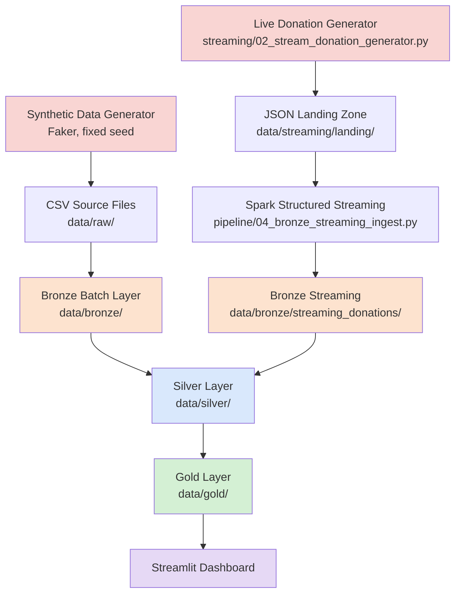
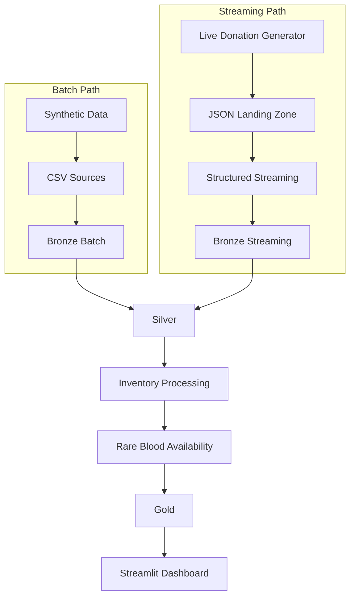

# 🩸 Rare Blood Type Availability Analytics Using PySpark Medallion Architecture

An end-to-end, laptop-friendly data engineering project that ingests, cleans, enriches, and analyzes blood donation and inventory data — both historical (batch) and simulated real-time (streaming) — to answer one central question:

> **Which rare blood type is available, how many units, and which blood bank currently has it?**

Built entirely with **PySpark (local mode)**, **Spark Structured Streaming**, **Parquet**, and a **Streamlit + Plotly** dashboard, following a full **Bronze → Silver → Gold** Medallion Architecture.

> ⚠️ **This project uses 100% synthetic data (generated with Faker) and is an educational/portfolio demonstration. It is not connected to any real blood bank system and must never be used for actual clinical or emergency decision-making.**

---

## Table of Contents

1. [Project Overview](#1-project-overview)
2. [Problem Statement](#2-problem-statement)
3. [Project Objectives](#3-project-objectives)
4. [Technology Stack](#4-technology-stack)
5. [Project Architecture](#5-project-architecture)
6. [Medallion Architecture](#6-medallion-architecture)
7. [Dataset Description](#7-dataset-description)
8. [Synthetic Data Generation](#8-synthetic-data-generation)
9. [Bronze Batch Ingestion](#9-bronze-batch-ingestion)
10. [Live Donation Stream Simulation](#10-live-donation-stream-simulation)
11. [Bronze Streaming Ingestion](#11-bronze-streaming-ingestion)
12. [Silver Layer](#12-silver-layer)
13. [Inventory Processing — How This Project Actually Handles It](#13-inventory-processing--how-this-project-actually-handles-it)
14. [Rare Blood Availability Logic](#14-rare-blood-availability-logic)
15. [Shortage Detection](#15-shortage-detection)
16. [Gold Layer](#16-gold-layer)
17. [Streamlit Dashboard](#17-streamlit-dashboard)
18. [Project Folder Structure](#18-project-folder-structure)
19. [Execution Guide](#19-execution-guide)
20. [Testing and Validation](#20-testing-and-validation)
21. [Error Handling](#21-error-handling)
22. [Performance Considerations](#22-performance-considerations)
23. [Security and Privacy](#23-security-and-privacy)
24. [Limitations](#24-limitations)
25. [Future Enhancements](#25-future-enhancements)
26. [Business Value](#26-business-value)
27. [Final End-to-End Workflow](#27-final-end-to-end-workflow)
28. [Final Project Summary](#28-final-project-summary)

---

## 1. Project Overview

Blood banks routinely face a difficult, time-sensitive question: *when a rare blood type is urgently needed, which center actually has it in stock right now?* This project builds a complete data pipeline that answers that question — and its supporting questions (trends, shortages, donor availability, blood-bank performance) — using industry-standard data engineering patterns rather than a spreadsheet or a single database query.

The project combines **two data paths** that converge into one analytical layer:

- A **batch path**: historical donor, blood bank, inventory, camp, and donation records generated once and ingested in bulk.
- A **streaming path**: a lightweight Python process simulates new donation events arriving one at a time, which Spark Structured Streaming picks up incrementally — without Kafka, Docker, or any message broker.

Both paths are cleaned and standardized through a shared **Silver layer**, then aggregated into a **Gold layer** of business-ready tables, which a **Streamlit dashboard** reads directly to visualize rare blood availability, shortages, blood-bank locations, and donation trends.

**End-to-end flow implemented in this project:**

```
Synthetic Data (Faker)
        │
        ▼
Bronze Batch Ingestion  ──────────┐
                                    │
Live Donation Generator             │
        │                           │
        ▼                           │
JSON Landing Zone                   │
        │                           │
        ▼                           │
Bronze Streaming Ingestion  ───────►│
                                    ▼
                            Silver Cleaning & Enrichment
                                    │
                                    ▼
                    Rare Blood Availability Processing
                                    │
                                    ▼
                            Gold Aggregations
                                    │
                                    ▼
                          Streamlit Dashboard
```

Everything runs **locally, in Spark local mode, on a single laptop** — there is no cluster, no cloud storage, and no external infrastructure anywhere in this project.

---

## 2. Problem Statement

Monitoring blood availability across multiple blood banks is a genuinely hard data problem, independent of any specific technology:

- **Inventory is distributed.** Stock is spread across many independent blood banks, each with its own partial view.
- **Rare blood groups are scarce by nature.** A handful of units at a handful of centers can mean the difference between "available" and "critical shortage."
- **Inventory changes constantly.** Donations arrive continuously; a snapshot taken an hour ago may already be stale.
- **Historical and live data must be reasoned about together.** A useful system can't treat "today's donations" and "last year's donations" as separate universes.
- **Finding the right center is non-trivial.** "Does anyone have O- right now?" is a join across donor, inventory, and blood-bank data — not a lookup.
- **Shortages need to be flagged quickly and consistently**, using the same rule everywhere, not ad hoc judgment.
- **Decision-makers need one consolidated view**, not five different spreadsheets.

This project addresses each of these directly: a **Medallion Architecture** consolidates distributed data into one trustworthy Silver layer; **Spark Structured Streaming** keeps the "live donation" story real without needing enterprise messaging infrastructure; explicit, **configurable thresholds** standardize shortage detection; and a purpose-built **Gold layer + dashboard** exist specifically to answer "where is the rare blood, and how much?" in a few seconds.

---

## 3. Project Objectives

1. Generate realistic, relationally-consistent synthetic blood donation data using Faker.
2. Build a PySpark-based batch ingestion pipeline (CSV → Bronze Parquet).
3. Implement a full Bronze → Silver → Gold Medallion Architecture.
4. Simulate live blood donation events as a lightweight, file-based JSON stream.
5. Implement Spark Structured Streaming to ingest that stream into Bronze incrementally.
6. Clean, standardize, deduplicate, and validate all donation and inventory data.
7. Maintain and analyze blood inventory by blood group, blood bank, and city.
8. Identify a configurable set of rare/priority blood groups for analytical focus.
9. Detect blood shortages using transparent, configurable, rule-based thresholds.
10. Identify exactly which blood banks currently hold a given rare blood type.
11. Produce a full set of analytics-ready Gold Parquet tables.
12. Build an interactive Streamlit + Plotly dashboard centered on rare blood availability.
13. Validate the complete pipeline with an automated test suite and an end-to-end validation report.

---

## 4. Technology Stack

| Technology | Purpose in This Project |
|---|---|
| **Python 3.12** | Primary language for data generation, streaming simulation, and orchestration scripts. |
| **PySpark 4.x (local mode)** | Core engine for all Bronze/Silver/Gold batch transformations, joins, and aggregations. |
| **Spark Structured Streaming** | Watches a JSON landing directory and incrementally ingests new donation events into Bronze, with checkpointing. |
| **Faker** | Generates realistic synthetic donor names, addresses, dates, and organization names with a fixed random seed for reproducibility. |
| **CSV** | Format for the initial Raw layer (`data/raw/*.csv`), produced by the data-generation script. |
| **JSON** | Format for simulated live donation events written to the streaming landing zone (one flat JSON object per file). |
| **Apache Parquet** | Storage format for every Bronze, Silver, and Gold dataset — columnar, compressed, and Spark-native. |
| **Pandas + PyArrow** | Used only in the Streamlit dashboard, to load already-small Gold Parquet tables for display (never for core Spark transformations). |
| **Streamlit** | Builds the interactive analytics dashboard. |
| **Plotly** | Charts and the interactive blood-bank location map inside the dashboard. |
| **pytest** | Automated test suite covering Bronze, Silver, Gold, inventory, rare blood logic, and streaming. |

No Kafka, Docker, Airflow, Databricks, Hadoop cluster, or cloud service is used anywhere in this project — everything listed above runs on a single laptop.

---

## 5. Project Architecture



Batch and streaming donation data are two **independent processes** that converge at the Silver layer: `pipeline/05_silver_transform.py` reads both `data/bronze/donations/` (historical) and `data/bronze/streaming_donations/` (live) and unions them into one clean, deduplicated donation table before anything downstream ever sees them.

---

## 6. Medallion Architecture

| Layer | Purpose | Input | Processing | Output | Format |
|---|---|---|---|---|---|
| **Bronze** | Preserve raw ingested data with minimal transformation | Raw CSV (batch) + JSON events (streaming) | Explicit schema application, ingestion metadata (`_ingested_at`, `_source_file`, `_ingestion_date`) — **no business logic** | One Parquet dataset per source table | Parquet |
| **Silver** | Clean, standardize, deduplicate, validate, and enrich | Bronze batch + Bronze streaming | Blood-group/status standardization, deduplication by `donation_id`, data-quality flags, left joins to donor/blood-bank/camp/inventory | Clean unified `donations` + `enriched_donations` + cleaned reference tables | Parquet |
| **Rare Blood Availability Processing** | Compute rare-blood-focused availability, shortages, and rankings directly from Silver | Silver inventory + blood banks + donations | Filtering to configured rare groups, threshold-based status classification, Window-function ranking | 8 `gold_*` rare-blood tables (see [Section 16](#16-gold-layer)) | Parquet |
| **Gold** | Business-ready analytics for every stakeholder question, not just rare blood | Silver donors, blood banks, inventory, camps, donations | Daily/monthly trends, blood-group distribution, blood-bank & camp performance, donor summaries, rare blood summaries | 12 final Gold tables consumed directly by the dashboard | Parquet |

**Bronze = raw + metadata. Silver = trustworthy + enriched. Gold = business-ready.** Each layer only ever reads from the layer below it and writes to its own directory — nothing upstream is ever modified.

---

## 7. Dataset Description

### Donors (`donors.csv` → `bronze/donors` → `silver/donors`)

| Column | Data Type | Description | Example |
|---|---|---|---|
| `donor_id` | string | Unique donor identifier | `DON0042` |
| `full_name` | string | Donor's synthetic full name | `Amaira Maharaj` |
| `gender` | string | Male / Female / Other | `Female` |
| `age` | integer | Donor age (18–60 in synthetic data) | `34` |
| `blood_group` | string | One of the 8 standard blood groups | `O-` |
| `city` | string | Donor's city (from a fixed set of 10 Indian cities) | `Mumbai` |
| `state` | string | State corresponding to `city` (always a valid pair) | `Maharashtra` |
| `registration_date` | date | When the donor registered | `2022-04-03` |
| `last_donation_date` | date, nullable | Most recent donation date (null if never donated) | `2026-01-15` |
| `eligibility_status` | string | Eligible / Temporarily Ineligible / Inactive | `Eligible` |

### Blood Banks (`blood_banks.csv` → `bronze/blood_banks` → `silver/blood_banks`)

| Column | Data Type | Description | Example |
|---|---|---|---|
| `blood_bank_id` | string | Unique blood bank identifier | `BB007` |
| `blood_bank_name` | string | Synthetic blood bank name | `LifeLine Blood Center - Pune` |
| `city` / `state` | string | Location (consistent pair) | `Pune` / `Maharashtra` |
| `address` | string | Synthetic street address | `54, MG Road, Pune, Maharashtra - 411001` |
| `latitude` / `longitude` | double | Coordinates near the city center | `18.5204` / `73.8567` |
| `storage_capacity` | integer | Synthetic storage capacity | `320` |
| `operating_status` | string | Active / Temporarily Closed | `Active` |

### Blood Inventory (`blood_inventory.csv` → `bronze/blood_inventory` → `silver/blood_inventory`)

| Column | Data Type | Description | Example |
|---|---|---|---|
| `inventory_id` | string | Unique inventory record identifier | `INV0042` |
| `blood_bank_id` | string | The blood bank this record belongs to | `BB007` |
| `blood_group` | string | Blood group this row tracks | `O-` |
| `available_units` | integer | Units currently in stock (≥ 0) | `8` |
| `reserved_units` | integer | Units reserved (not yet allocated) | `2` |
| `last_updated` | timestamp | When this inventory row was last updated | `2026-07-05 14:06:00` |
| `inventory_status` | string | Snapshot-time status label from Phase 2 generation | `LOW` |

> **Important:** not every blood bank has an inventory row for every blood group — this is intentional (see [Section 8](#8-synthetic-data-generation)), so the data can meaningfully answer "which banks have O-?" instead of trivially "all of them."

### Donation Camps (`donation_camps.csv` → `bronze/donation_camps` → `silver/donation_camps`)

| Column | Data Type | Description | Example |
|---|---|---|---|
| `camp_id` | string | Unique camp identifier | `CAMP005` |
| `camp_name` | string | Synthetic camp name | `Rotary Club Blood Donation Drive` |
| `organizer` | string | Organizing entity | `Rotary Club` |
| `city` / `state` | string | Camp location | `Pune` / `Maharashtra` |
| `camp_date` | date | Date the camp was held | `2024-07-01` |
| `location` | string, nullable | Ground/venue description | `Bali Road Grounds, Pune` |
| `expected_donors` | integer | Anticipated turnout | `120` |

### Donations (`donations.csv` → `bronze/donations` + `bronze/streaming_donations` → `silver/donations`)

| Column | Data Type | Description | Example |
|---|---|---|---|
| `donation_id` | string | Unique donation ID (`DONATION####` batch, `LIVE-DONATION-######` streaming) | `DONATION0512` |
| `donor_id` | string | Donor who gave this donation | `DON0042` |
| `blood_bank_id` | string | Receiving blood bank | `BB007` |
| `camp_id` | string, nullable | Associated camp, if any | `CAMP005` |
| `donation_date` | date | Date of donation | `2026-04-13` |
| `blood_group` | string | **Always equal to the donor's own `blood_group`** — never assigned independently | `O-` |
| `units_donated` | integer | Units given (1–3 in historical data, 1–2 in streaming) | `1` |
| `donation_status` | string | Completed / Cancelled / Rejected | `Completed` |

> **Note on field naming:** this project's actual pipeline uses `donation_status` (not `status`) for both historical and streaming donations, and `full_name` (not `name`) for donors — the Silver layer standardizes on these names throughout.

---

## 8. Synthetic Data Generation

**Script:** `data_generation/01_generate_seed_data.py`

All data is generated with **Faker**, seeded with a fixed `SEED = 42` so every run is fully reproducible.

**Generated volumes** (configurable constants at the top of the script):

| Dataset | Count |
|---|---|
| Donors | 200 |
| Blood banks | 20 |
| Donation camps | 15 |
| Historical donations | 2,000 (+ ~1% intentional duplicate rows, injected on purpose for the Silver layer to clean up) |
| Blood inventory | ~100–110 records (not every bank × every blood group — see below) |

**How relational consistency is maintained** (never purely random, unrelated records):

- Every `donation.donor_id` exists in `donors.csv`; every `donation.blood_bank_id` exists in `blood_banks.csv`; every non-null `donation.camp_id` exists in `donation_camps.csv`.
- **`donation.blood_group` is always copied directly from the selected donor's own `blood_group`** — it is never generated independently, by explicit design, so blood-group consistency checks always hold by construction.
- Donation dates are always on or after the donor's `registration_date`.
- City/state pairs are drawn from a fixed lookup of 10 real Indian city/state combinations — cities and states are never mismatched.
- Blood-group distribution is **weighted**, not uniform: common groups (O+, A+, B+) appear more often than rare groups (O-, AB-, B-, A-), while still guaranteeing meaningful rare-group representation for analysis.
- Inventory generation explicitly ensures: at least one blood bank stocks 2+ rare blood groups, at least one city has 2+ banks carrying the same rare group, at least one rare group is available across multiple cities, and at least one CRITICAL and one LOW rare-blood inventory record exist — so the downstream rare-blood analytics always have something meaningful to show, rather than relying on chance.
- A small number of **controlled** data-quality issues are deliberately introduced (duplicate donation rows, a few donors with no prior donation, a few camps with missing location text) — but foreign keys, blood groups, and IDs are never made invalid, so the Silver layer has real cleaning work to do without the whole dataset being broken.

---

## 9. Bronze Batch Ingestion

**Script:** `pipeline/03_bronze_batch_ingest.py`

1. Read each of the 5 raw CSVs using **explicit PySpark schemas** (not `inferSchema`) — explicit schemas avoid an extra full-file read pass and prevent Spark from misreading IDs like `"007"` as numbers.
2. Add three ingestion metadata columns to every record: `_ingested_at` (`current_timestamp()`), `_source_file` (literal filename), `_ingestion_date` (`current_date()`).
3. Write each dataset to its own Parquet directory under `data/bronze/` using `.mode("overwrite")` — **no `coalesce(1)`**, since Bronze should behave like a normal multi-file data lake layer.
4. Validate row counts (raw CSV count == Bronze Parquet count) and metadata completeness, printing a PASS/FAIL table.

**Why Parquet:** columnar storage, built-in compression, and native Spark schema preservation make it far more efficient than CSV for every downstream read — and Bronze, Silver, and Gold all use it consistently so no format conversion happens mid-pipeline.

```
data/bronze/
├── donors/
├── blood_banks/
├── blood_inventory/
├── donation_camps/
└── donations/
```

Bronze performs **zero business transformations** — no deduplication, no blood-group standardization, no filtering. It is the raw source data plus ingestion metadata, nothing more.

---

## 10. Live Donation Stream Simulation

**Script:** `streaming/02_stream_donation_generator.py`

This script simulates a live donation feed **without Kafka or any message broker** — it simply writes one flat JSON file per donation event into a landing directory, on a configurable interval.

- **Configurable via CLI:** `--interval` (seconds between events), `--count` (number of events), `--rare-probability`, `--camp-probability`, `--seed`, `--clear`.
- Every event's `donor_id`, `blood_bank_id`, and `camp_id` are drawn from the **actual** `donors.csv` / `blood_banks.csv` / `donation_camps.csv` — never invented.
- `blood_group` is always the selected donor's real blood group.
- `donation_id` uses a clearly distinct format (`LIVE-DONATION-000001`) so live and historical donations are never confused.
- Filenames never overwrite previous events (the script scans existing files and continues the sequence), and Ctrl+C stops cleanly without corrupting or deleting anything already written.

**Example event** (as actually produced by this project):

```json
{
  "donation_id": "LIVE-DONATION-000001",
  "donor_id": "DON0042",
  "blood_bank_id": "BB007",
  "camp_id": "CAMP003",
  "donation_date": "2026-08-08",
  "blood_group": "O-",
  "units_donated": 1,
  "donation_status": "Completed",
  "event_time": "2026-08-08T14:35:21",
  "source": "live_donation_simulator",
  "event_type": "blood_donation"
}
```

```
data/streaming/landing/
├── donation_000001.json
├── donation_000002.json
└── ...
```

---

## 11. Bronze Streaming Ingestion

**Script:** `pipeline/04_bronze_streaming_ingest.py`

```
JSON Landing Zone (data/streaming/landing/)
        │
        ▼
Spark Structured Streaming (readStream, explicit schema)
        │
        ▼
+ Streaming ingestion metadata (_ingested_at, _source_file, _ingestion_date)
        │
        ▼
Bronze Streaming Parquet (data/bronze/streaming_donations/)
        +
Checkpoint (data/checkpoints/bronze_streaming_donations/)
```

- **File-stream source**, explicit schema (donation_id, donor_id, blood_bank_id, camp_id, donation_date, blood_group, units_donated, donation_status, event_time, source, event_type).
- **`multiLine("true")`** is required on the JSON reader — the generator writes pretty-printed, indented JSON, and Spark's default reader expects one compact object per line. Without this option, every field silently comes back `null`.
- **`outputMode("append")`** — every donation event is an immutable fact; Bronze only ever adds rows.
- **`.trigger(processingTime="5 seconds")`** (configurable via `--trigger`) — Spark checks for new files on this interval rather than reacting file-by-file.
- **Checkpointing** (`checkpointLocation`) records exactly which files have already been processed, so restarting the streaming job never reprocesses old events or loses progress.
- `event_time` (when the donation was simulated to occur) is kept **separate** from `_ingested_at` (when Spark actually processed it) — an important distinction for any real streaming system, even though they're usually close together in this demo.

**Run duration and Ctrl+C:** the query polls `awaitTermination()` in short 1-second slices rather than one long blocking call — this ensures a Ctrl+C is reliably delivered as a normal Python `KeyboardInterrupt` (a single long blocking JVM call can otherwise swallow the signal).

---

## 12. Silver Layer

**Script:** `pipeline/05_silver_transform.py`

### Duplicate Handling
`donation_id` is the natural key; after combining historical and streaming donations, `dropDuplicates(["donation_id"])` removes exact duplicate donation events. This is the **only** case where Silver removes rows outright — everything else is flagged, not deleted.

### Missing Value Handling
Missing `gender`, `city`, and `eligibility_status` on donors are filled with `"Unknown"` rather than dropping the donor. Missing `location` on camps is left as-is (a donation directly at a blood bank legitimately has no camp).

### Blood Group Standardization
A single, reusable Spark expression (regex-based, case-insensitive, no Python UDF) handles variants such as:

```
"O negative", "O NEG", "o-"        → "O-"
"AB positive", "AB POS", "ab+"     → "AB+"
```

Any value that still doesn't match one of the 8 valid groups after normalization is left as-is and flagged `is_valid_blood_group = false` — never guessed or invented.

### Date Standardization
`registration_date`, `last_donation_date`, `donation_date`, and `camp_date` are all cast to Spark `DateType`; `event_time` and `last_updated` to `TimestampType`.

### Donation Validation
Adds `is_valid_blood_group`, `is_valid_donation_quantity` (1–5 units), `is_valid_donation_date` (not null, not in the future), `is_valid_donation_status`, and an overall `overall_data_quality_status` (`VALID` / `REVIEW`) — flagged, never silently dropped.

### Foreign Key / Referential Checks
`donor_exists`, `blood_bank_exists`, `inventory_record_exists`, and `camp_exists` (nullable — `null` means "no camp was referenced," `false` means "a camp was referenced but not found") are computed via **LEFT JOINs**, so a donation is never dropped just because a related record is missing.

### Batch + Streaming Integration
`donations` (historical) and `streaming_donations` (Bronze) are cleaned with the same logic, aligned to one shared column set, combined with `unionByName(allowMissingColumns=True)`, then deduplicated. If `data/bronze/streaming_donations/` doesn't exist yet (Phase 5 hasn't been run), the script prints a warning and continues with historical data only — it never crashes.

**Silver outputs:**
```
data/silver/
├── donors/
├── blood_banks/
├── blood_inventory/
├── donation_camps/
├── donations/            (clean, unified, deduplicated, flagged)
├── enriched_donations/   (donations + donor + blood-bank + camp + inventory)
└── data_quality/         (one-row summary report)
```

---

## 13. Inventory Processing — How This Project Actually Handles It

This project does **not** implement a running "current inventory = starting inventory + donation additions" balance update. Being transparent about the actual implementation rather than describing an idealized one that wasn't built:

- `blood_inventory` is a **synthetic, point-in-time snapshot** generated independently in Phase 2 (Faker), representing "what each blood bank currently has in stock."
- `donations` is a **separate transactional log** of donation events over time.
- **These two are deliberately never merged into a live running balance.** Inventory analytics (Sections 14–16) always read `available_units` directly from the inventory snapshot; donation analytics (daily/monthly trends, donor/camp performance) always read from the donations table.
- The two are connected only through **joins for correlation and enrichment** (e.g., `enriched_donations` attaches the current `available_units` for the matching blood bank + blood group at read time), never through an inventory-mutation step.

This keeps the project honest and simple to explain: "here is what's in stock right now" and "here is what has been donated over time" are two clearly separate, individually trustworthy datasets, rather than one opaque derived number. A real production system would need genuine transactional inventory updates (and concurrency control) that were intentionally out of scope for a laptop demo.

Inventory is grouped and analyzed by **blood bank**, **blood group**, and **city/state** throughout the Gold layer (Section 16).

---

## 14. Rare Blood Availability Logic

**Configured rare/priority blood groups** (used consistently everywhere in the project):

```python
RARE_BLOOD_GROUPS = ["O-", "AB-", "B-", "A-"]
```

> **This is a project-defined analytics classification for demonstration purposes, not a universal medical rarity guideline.** Real-world blood-group rarity varies by population and region.

### Rare Blood Availability

Computed at multiple grains — deliberately, because a system-wide total can hide a real local shortage:

| Grain | Gold table | Example finding in this project's own generated data |
|---|---|---|
| Blood-group total (all banks) | `rare_blood_summary` | O-: 138 units across 10 banks — looks "AVAILABLE" |
| Per blood bank | `blood_bank_rare_stock` | Individual banks range from 0 units (OUT_OF_STOCK) to 20+ (AVAILABLE) |
| Per city | `city_blood_availability` | Nagpur's A- and O- were found completely OUT_OF_STOCK even while the citywide total looked healthy |

### Availability Status

Two threshold vocabularies exist in this project's Gold layer, from two different stages of the pipeline — documented honestly rather than glossed over:

**`gold_*` tables** (`pipeline/07_rare_blood_availability.py` — "Rare Blood Availability Processing" stage):
```python
CRITICAL_MAX_UNITS = 2    # 0–2 units    → CRITICAL
LOW_MAX_UNITS = 5         # 3–5 units    → LOW
MODERATE_MAX_UNITS = 10   # 6–10 units   → MODERATE
                          # >10 units     → GOOD
```

**Final Gold tables** (`pipeline/08_gold_aggregate.py` — consumed directly by the dashboard):
```python
CRITICAL_THRESHOLD = 5
LOW_THRESHOLD = 10
# available_units == 0           → OUT_OF_STOCK
# available_units <= 5           → CRITICAL
# available_units <= 10          → LOW
# available_units > 10           → AVAILABLE
```

Both are defined once, in a single configuration block, and reused everywhere within their respective script — never hard-coded inline.

---

## 15. Shortage Detection

The Gold-layer shortage rule (as actually implemented, `pipeline/08_gold_aggregate.py`):

```python
def availability_status(units):
    if units == 0:
        return "OUT_OF_STOCK"
    elif units <= CRITICAL_THRESHOLD:      # <= 5
        return "CRITICAL"
    elif units <= LOW_THRESHOLD:           # <= 10
        return "LOW"
    else:
        return "AVAILABLE"
```

Each status also maps to a numeric **severity score** (`OUT_OF_STOCK=3, CRITICAL=2, LOW=1, AVAILABLE=0`) so the `blood_shortage_report` Gold table can be sorted worst-first, and a rule-based **recommended action** string (e.g., *"Urgent donor mobilization required"*).

Thresholds are configurable constants at the top of the script — changing the rare-blood definition or the shortage boundaries never requires touching more than one place. **Phase 10's automated test suite explicitly tests every boundary value** (0, 4, 5, 9, 10, 11) to catch off-by-one classification bugs — see [Section 20](#20-testing-and-validation).

---

## 16. Gold Layer

This project's **final, dashboard-facing Gold layer** (`pipeline/08_gold_aggregate.py`) contains 13 tables:

| Gold Table | Purpose | Key Metrics | Dashboard Usage |
|---|---|---|---|
| `daily_donation_summary` | Day-by-day donation activity | total_donations, total_units_donated, unique_donors, active_blood_banks | Donations tab line chart |
| `monthly_donation_summary` | Month-by-month donation trend | year, month, total_donations, total_units_donated | Donations tab line chart |
| `blood_group_distribution` | Share of donations by all 8 blood groups | total_donations, total_units_donated, percentage_of_total | Donations tab bar/pie chart |
| `rare_blood_availability` | Record-level rare blood stock, join-ready | blood_bank_id, blood_group, available_units, availability_status | Overview / Rare Blood tabs |
| `rare_blood_summary` | Blood-group-level rare blood totals | total_available_units, number_of_banks_with_stock, availability_status | Overview KPIs, alerts |
| `blood_shortage_report` | Worst-first shortage ranking | shortage_status, severity_score | Shortages tab |
| `blood_bank_rare_stock` | **"Where can I find this rare blood type?"** | blood_bank_id, city, blood_group, available_units | Blood Banks tab (main table + map) |
| `blood_bank_rare_stock_available` | Same as above, pre-filtered to `available_units > 0` | — | Convenience dataset for the dashboard |
| `city_blood_availability` | Rare blood totals by city/state | total_available_units, banks_with_stock | Rare Blood tab city chart |
| `blood_bank_performance` | Overall blood bank activity + rare capability | total_donations_received, rare_blood_units, rare_blood_types_available | Performance tab |
| `donation_camp_performance` | Camp-level donation yield | total_donations, total_units_collected | Performance tab |
| `donor_summary` | Every donor (roster), with rare-donor flag | total_donations, is_rare_blood_donor | Donors tab statistics |
| `rare_donor_summary` | Rare-blood-group donor pool | total_donors, active_donors | Donors tab main table |

> **Also present in `data/gold/`:** eight additional `gold_*`-prefixed tables from `pipeline/07_rare_blood_availability.py` (e.g. `gold_rare_blood_center_ranking`, `gold_zero_rare_inventory`). These represent the project's "Rare Blood Availability Processing" architectural stage — an earlier, self-contained rare-blood-only Gold pass built directly from Silver. They coexist alongside the final 12 tables above (different folder names, no collisions) and were an intermediate step in the project's build order; **the dashboard reads from the 12 tables listed above.**

Only donations with `donation_status == "Completed"` are counted in every donation-based Gold aggregate — a Cancelled or Rejected donation never actually added usable blood, so counting it would overstate supply.

---

## 17. Streamlit Dashboard

**File:** `dashboard/app.py` — launch with `streamlit run dashboard/app.py`

### Purpose & Central Workflow

The dashboard exists to support exactly one user journey, end to end, in under a few seconds:

```
RARE BLOOD TYPE → IS IT AVAILABLE? → HOW MANY UNITS? →
WHICH BLOOD BANK HAS IT? → WHICH CITY? → LOW OR CRITICAL? →
ARE THERE RARE-BLOOD DONORS?
```

### KPI Cards (top of page, always visible)

`Rare Blood Units Available` · `Blood Banks With Rare Blood` · `Critical Blood Groups` · `Out-of-Stock Blood Groups` · `Rare Blood Donors` · `Total Donations` · `Total Blood Units` · `Today's Donations`

Any KPI that can't be calculated (missing dataset) shows `N/A` rather than crashing.

### Tabs

| Tab | Contents |
|---|---|
| **Overview** | Rare blood summary table, dynamically-generated shortage alerts, main availability chart |
| **Rare Blood Availability** | Full rare blood summary + city-wise table and chart |
| **Blood Banks** | Filterable blood-bank table, top-banks ranking chart, interactive Plotly map (real lat/long only — never fabricated) |
| **Shortages** | Severity-sorted shortage table and chart |
| **Donations** | Daily/monthly trend line charts, blood-group distribution bar + pie charts |
| **Donors** | Rare donor table + chart, aggregated donor statistics (no personal details beyond name/city) |
| **Performance** | Blood bank performance table + chart, donation camp performance table + chart |
| **Live Feed** | Most recent Bronze streaming donation events, or a graceful "unavailable" message if streaming hasn't been run |

### Filters (sidebar)

Blood Group · Show rare blood only (checkbox) · State · City · Blood Bank · Availability Status · Date Range · 🔄 Refresh Dashboard button (clears the cache and reloads Gold data after a pipeline rerun)

### Data Loading

Every Gold/Bronze Parquet dataset is loaded through one small, `@st.cache_data`-decorated function (`load_parquet`) that returns `None` — never raises — if a file is missing, so every tab can degrade gracefully with a specific "please run `pipeline/08_gold_aggregate.py`" message instead of crashing.

---

## 18. Project Folder Structure

This is the **actual** structure produced by this project (not an idealized template):

```
enterprise-blood-donation-analytics/
│
├── data_generation/
│   └── 01_generate_seed_data.py
│
├── streaming/
│   └── 02_stream_donation_generator.py
│
├── pipeline/
│   ├── 03_bronze_batch_ingest.py
│   ├── 04_bronze_streaming_ingest.py
│   ├── 05_silver_transform.py
│   ├── 07_rare_blood_availability.py
│   └── 08_gold_aggregate.py
│
├── dashboard/
│   └── app.py
│
├── tests/
│   ├── __init__.py
│   ├── conftest.py
│   ├── test_bronze.py
│   ├── test_data_quality.py
│   ├── test_silver.py
│   ├── test_inventory.py
│   ├── test_rare_blood.py
│   ├── test_gold.py
│   └── test_streaming.py
│
├── validation/
│   ├── __init__.py
│   ├── validators.py
│   ├── validation_report.py
│   └── validation_results/
│       ├── validation_report.txt
│       └── validation_results.json
│
├── data/
│   ├── raw/                       (5 CSVs)
│   ├── bronze/                    (6 Parquet datasets, incl. streaming)
│   ├── silver/                    (7 Parquet datasets)
│   ├── gold/                      (21 Parquet datasets: 13 final + 8 rare-blood-processing)
│   ├── streaming/landing/         (JSON events)
│   └── checkpoints/               (Structured Streaming checkpoint)
│
├── requirements.txt
└── README.md
```

> **Numbering note:** pipeline scripts are numbered `03`–`08` (not `01`/`02`, which belong to data generation and streaming) to reflect true execution order across the whole project, including the two non-`pipeline/` phases that run before Bronze batch ingestion.

---

## 19. Execution Guide

### Step 1: Obtain the Project

Unzip or clone the project, then `cd` into the project root (`enterprise-blood-donation-analytics/`).

### Step 2: Create a Virtual Environment

**Linux/macOS:**
```bash
python3 -m venv .venv
source .venv/bin/activate
```

**Windows (PowerShell):**
```powershell
python -m venv .venv
.venv\Scripts\Activate.ps1
```

> PySpark also requires a **Java runtime (JDK 8, 11, 17, or 21)** on `PATH` — install one separately (e.g. Eclipse Temurin) if `java -version` fails.

### Step 3: Install Dependencies

```bash
pip install -r requirements.txt
```

### Step 4: Generate Synthetic Data

```bash
python data_generation/01_generate_seed_data.py
```
Produces `data/raw/*.csv` and prints a rare-blood-focused validation summary.

### Step 5: Run Bronze Batch Ingestion

```bash
python pipeline/03_bronze_batch_ingest.py
```
Produces `data/bronze/donors/`, `blood_banks/`, `blood_inventory/`, `donation_camps/`, `donations/`.

### Step 6 (Optional): Start the Live Donation Generator

```bash
python streaming/02_stream_donation_generator.py --interval 2 --count 100
```
Writes JSON events to `data/streaming/landing/`. Runs in a separate terminal from Step 7.

### Step 7 (Optional): Run Bronze Streaming Ingestion

```bash
python pipeline/04_bronze_streaming_ingest.py --minutes 3
```
Watches the landing zone and writes `data/bronze/streaming_donations/`. Can be started **before** Step 6 so no early events are missed. If skipped, later steps automatically fall back to historical-only data with a warning — nothing crashes.

### Step 8: Run Silver Processing

```bash
python pipeline/05_silver_transform.py
```
Produces the full `data/silver/` layer.

### Step 9: Run Rare Blood Availability Processing

```bash
python pipeline/07_rare_blood_availability.py
```
Produces the 8 `gold_*`-prefixed rare-blood tables.

### Step 10: Generate Final Gold Tables

```bash
python pipeline/08_gold_aggregate.py
```
Produces the 12 Gold tables the dashboard reads.

### Step 11: Launch the Dashboard

```bash
streamlit run dashboard/app.py
```
Opens at `http://localhost:8501`.

---

## 20. Testing and Validation

**Run the automated test suite:**
```bash
pytest tests/ -v
```

**Generate the end-to-end validation report:**
```bash
python validation/validation_report.py
```
Writes `validation/validation_results/validation_report.txt` and `validation_results.json`.

### Data Quality Tests
Null checks (`donor_id`, `blood_group`, `city`, `available_units`, etc.), duplicate checks (`donor_id`, `blood_bank_id`, `inventory_id`, `camp_id`, `donation_id`), invalid blood group detection (values outside the 8-value set), invalid `units_donated` (null/zero/negative), and donor eligibility field checks — explicitly scoped as **data-quality validation, not a clinical eligibility system**.

### Referential Integrity
`donations.donor_id → donors.donor_id`, `donations.blood_bank_id → blood_banks.blood_bank_id`, `donations.camp_id → donation_camps.camp_id` (nulls allowed), `blood_inventory.blood_bank_id → blood_banks.blood_bank_id`.

### Inventory Tests
`available_units >= 0` (verified never negative), every inventory record references a real blood bank, and — because this project does **not** implement a live balance-update system (see Section 13) — there is no "double counting" risk between donations and inventory to test, since the two are never merged.

### Streaming Tests
Landing directory exists and JSON files are well-formed with all required fields; Bronze streaming Parquet is readable with no duplicate `donation_id`; checkpoint directory exists.

### Gold Validation
Every Gold table checked for existence, readability, required columns, and row count > 0; **reconciliation checks** compare Gold totals back to Silver (e.g. Silver's O- inventory total must equal Gold's O- availability total; Silver's completed donation units must equal Gold's blood-group-distribution total).

**Example test case — shortage boundary classification** (`tests/test_rare_blood.py`):

| units | expected status |
|---|---|
| 0 | OUT_OF_STOCK |
| 4 | CRITICAL |
| 5 | LOW |
| 9 | LOW |
| 10 | AVAILABLE |
| 11 | AVAILABLE |

All 46 tests pass against this project's own generated data, and the validators were separately confirmed (during development) to actually **catch** injected problems — a negative inventory value, an orphaned foreign key, and a duplicate ID were each deliberately introduced into in-memory test copies and correctly flagged FAIL.

---

## 21. Error Handling

| Scenario | Behavior |
|---|---|
| Missing required Bronze/Silver dataset | Pipeline script raises a clear `FileNotFoundError`-based message naming the exact missing path and which prior script to run, then exits with a non-zero code — never a silent partial run. |
| Bronze streaming dataset missing | Silver script prints a specific warning and continues with historical data only. |
| Malformed / multi-line JSON | Explicitly handled with `multiLine("true")` in the streaming reader (see Section 11) — this was a real issue found and fixed during development. |
| Duplicate donation events | Removed by `dropDuplicates(["donation_id"])` in Silver — the only case where Silver deletes rows. |
| Invalid blood groups / negative units / broken foreign keys | Never silently dropped — flagged with dedicated boolean/status columns (`is_valid_blood_group`, `overall_data_quality_status`, etc.) for downstream review. |
| Streaming job interrupted (Ctrl+C) | Query stops cleanly via a polling `awaitTermination()` loop; output, checkpoint, and landing-zone files are never deleted. |
| Dashboard: missing Gold dataset | Shows a specific "run `pipeline/08_gold_aggregate.py`" warning per section instead of crashing the whole app. |
| Dashboard: filter matches zero rows | Shows "No data available for the selected filters." |

---

## 22. Performance Considerations

- **Explicit schemas everywhere** (Bronze batch and streaming) — avoids the extra read pass `inferSchema` requires and guarantees a stable contract for every downstream layer.
- **Parquet storage** throughout Bronze/Silver/Gold — columnar, compressed, and supports column pruning and predicate pushdown natively.
- **Spark SQL built-in functions used throughout** (`when`, `regexp_replace`, window functions, joins) — Python UDFs are avoided entirely in this project, since they block Spark's Catalyst optimizer from optimizing across the expression.
- **`coalesce(1)` used only for small, final Gold tables** (a few rows to a few thousand), never for Bronze or Silver — Bronze/Silver keep normal multi-part Spark output, appropriate for a real data-lake layer.
- **Left joins used deliberately** in Silver enrichment rather than inner joins, so no data is silently lost to a join filter.
- No repartitioning, broadcast-join hints, or custom partitioning strategy were needed at this dataset's scale (hundreds to a few thousand rows per table) — this is stated plainly rather than claiming an optimization that wasn't actually necessary or measured.

---

## 23. Security and Privacy

All data in this project is **synthetic**, generated by Faker — no real donor, patient, or blood-bank information is used anywhere.

A real-world implementation of a system like this would need to additionally protect:

- **Donor identity and contact information** — encrypted at rest, access-controlled, and never logged in plaintext.
- **Healthcare-related fields** (blood group, donation history) — treated as sensitive health data under applicable regulations (e.g. HIPAA-equivalent frameworks).
- **Storage and database credentials** — kept out of source control, managed via a secrets manager.
- **Access permissions** — role-based access so only authorized staff can view donor-identifying fields, separate from aggregate analytics.

Consistent with that principle, this project's own dashboard (Section 17) only ever displays **aggregated** donor statistics, never a browsable roster of individual contact details.

---

## 24. Limitations

- All data is synthetic (Faker-generated), not real blood-bank records.
- No integration with any real hospital, blood bank, or emergency-request system.
- The "live" donation stream is a simulation (a Python script writing JSON files), not a connection to a real point-of-donation system.
- Inventory is a static snapshot correlated with — but not derived from — the donation log (see Section 13); it is not a real transactional balance.
- No geographic routing or "nearest available center" logic — only city/state grouping and a static map.
- The dashboard is an analytics demonstration; it is explicitly **not** a clinical decision-support or emergency-response tool.
- Shortage and rarity thresholds are configurable project assumptions, not medical standards.
- Two slightly different threshold vocabularies exist across the `gold_*` (Phase 7) and final Gold (Phase 8) tables, documented transparently in Section 14 rather than silently — a real single-source-of-truth Gold layer would consolidate these.

---

## 25. Future Enhancements

- Kafka (or a managed equivalent) for genuine real-time ingestion at scale.
- Integration with real (anonymized/consented) blood-bank inventory APIs.
- Delta Lake or Apache Iceberg for ACID-compliant, time-travel-capable table storage.
- Apache Airflow (or Dagster) for pipeline orchestration and scheduling instead of manual script execution.
- Cloud deployment (AWS/Azure/GCP) with managed Spark (EMR/Databricks/Dataproc) and object storage.
- Real-time shortage alerting via SMS/email/webhook.
- Geospatial "nearest available blood bank" search using proper routing, not straight-line distance.
- Statistical or ML-based demand forecasting and shortage prediction.
- A genuine transactional inventory-update system replacing the current snapshot-plus-correlation approach.
- Role-based dashboard access separating aggregate analytics from any donor-identifying views.

---

## 26. Business Value

- **Faster identification of rare blood availability** — a filtered dashboard lookup instead of manually calling multiple blood banks.
- **Centralized inventory visibility** across every blood bank in the system, in one place.
- **Early, consistent shortage detection** via transparent, configurable thresholds rather than ad hoc judgment.
- **Blood bank comparison and ranking** by rare-blood capability and overall donation performance.
- **Geographic availability analysis** — city-level rollups highlight locations that look fine in aggregate but are critically low locally.
- **Donation trend monitoring** — daily/monthly views make it possible to see whether supply is keeping pace with demand over time.
- **Visibility into incoming donations** as they happen, via the live feed.
- **Better resource and campaign planning** — camp and donor analytics indicate where future donation drives would have the most impact.

This project demonstrates *how* such a system could be built and what it could show — it does not itself provide clinical recommendations, and no output from it should inform an actual medical decision.

---

## 27. Final End-to-End Workflow



---

## 28. Final Project Summary

This project demonstrates a complete, realistic PySpark data engineering pipeline — Bronze, Silver, and Gold layers; batch **and** Structured Streaming ingestion; explicit schema management; deduplication and referential-integrity validation; configurable, rule-based business logic; and a purpose-built analytics dashboard — applied to a genuinely useful healthcare analytics problem: **rare blood type availability**.

It intentionally favors clarity and correctness over unnecessary infrastructure: every architectural choice (no Kafka, no cloud, `coalesce(1)` only where it matters, explicit schemas over inference, left joins over inner joins, flag-don't-delete data quality) is one that a real data engineering interview or portfolio review would expect to be explained and justified — and every claim in this document reflects the actual, tested implementation, not an idealized one.

**Technically, it demonstrates:** PySpark DataFrame and SQL transformations, Spark Structured Streaming with checkpointing, Medallion Architecture design, data-quality engineering, Window functions, multi-grain business aggregation, and dashboard development with Streamlit and Plotly.

**As a portfolio piece, it demonstrates:** the ability to take an ambiguous, real-world-shaped problem (rare blood availability) and turn it into a working, tested, end-to-end system — while being explicit about what was actually built versus what a production version would still need.
